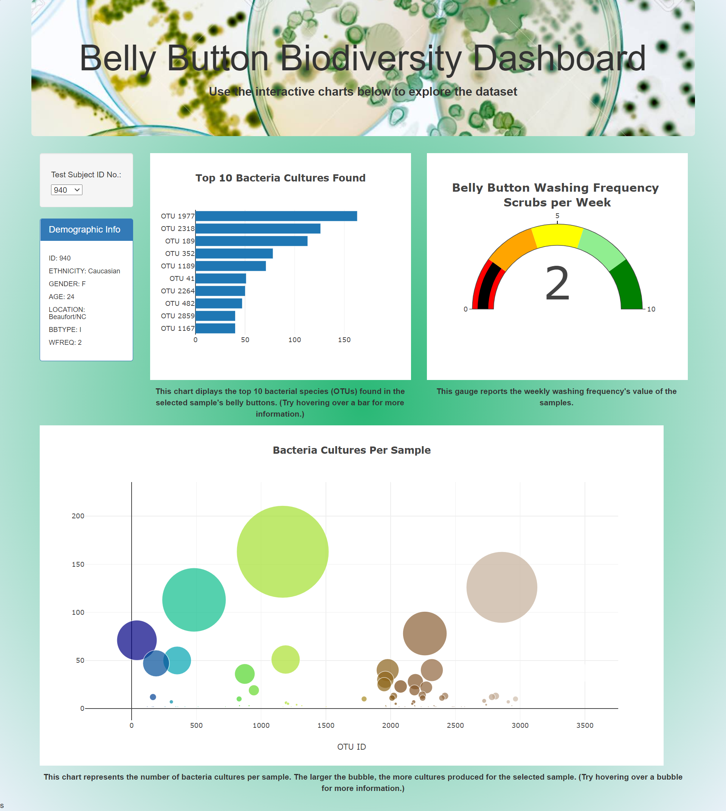

# Belly_Button_Biodiversity
## Purpose
Roza believes that the ideal bacteria needed to synthesize beef can be found in the belly button of some individuals. The purpose of this project was to assist Roza with building a dashboard that researchers and study participants can assess to view the data collected during her research.

## Resources:
- Data Source: [samples.json](samples.json)
- Software: Chrome version 88.0.4324.190; Git Bash version 2.29.2.windows.2; GitHub; VS Code version 1.53.2
 

To access the interactive webpage, please visit: [Belly Button Biodiversity Dashboard](https://danig89.github.io/Belly_Button_Biodiversity/).
 
<b>Note: Jumbotron image does not display in the above link. Please view image below for completed webpage.
 
 
  

